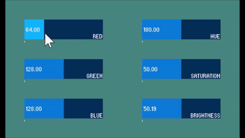

# ColorSpace
ProcessingでRGB色空間とHSB色空間（HSV色空間）を相互変換

##動作例
 f:id:hillstop:20160203173718g:plain

GUIとしてスライダを実装しています。スライダを操作すると、値に応じて背景の色が変化します。

左3つのスライダがRGB色空間、右3つのスライダがHSB色空間に対応しています。
一方の色空間のスライダを調節すると、もう一方の色空間の各値も自動的に変換されるようになっています。

Processingの実装上HSB色空間としていますが、HSV色空間と同じみたいです。

##実行環境
Processing 3.0.1
ライブラリとして、controlP5を使用しました。
http://www.sojamo.de/libraries/controlP5/
